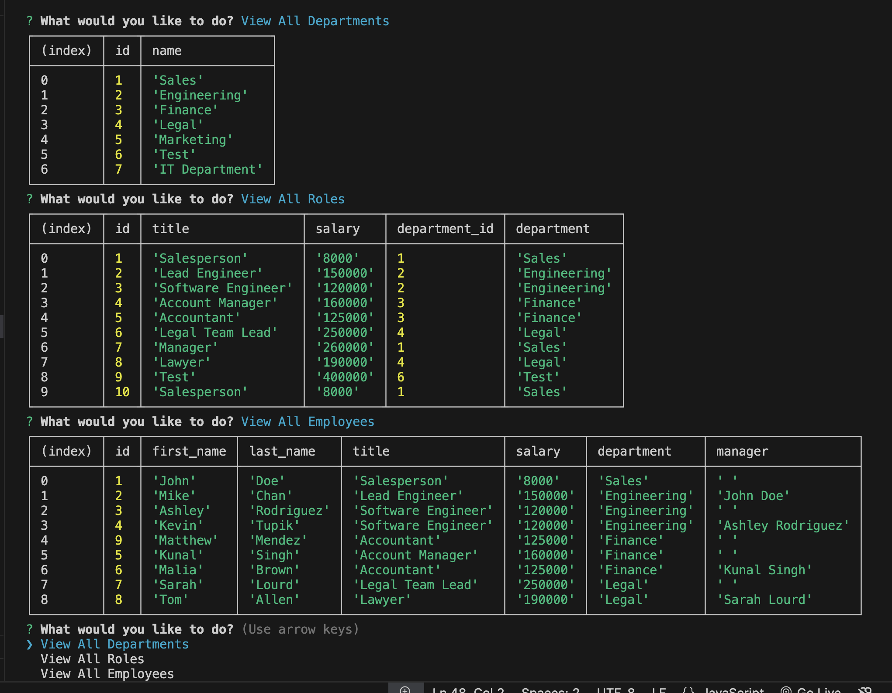

<h1 align="center">Employee Tracker Application</h1>

### Table of Contents
- [Description](#description)
- [Installation](#installation)
- [Database Setup](#database-setup)
- [Usage](#usage)
- [Technologies Used](#technologies-used)
- [License](#license)
- [Screenshot](#screenshot)
- [Questions](#questions)

### Description
This application is a Employee Management System. It is a command-line application that allows business owners to manage their company's departments, roles, and employees efficiently. By providing a streamlined interface to view and manage company data, the application helps organize and plan business operations effectively.

## Installation
To install and run the application locally, follow these steps:
Clone the Repository:
git clone <repository-url>

## Install Dependencies: 
Navigate to the project folder and install the necessary dependencies using npm: 
npm install

## Database Setup: 
You need to configure your database (MySQL) to store and retrieve information about departments, roles, and employees. Ensure your database connection details are correctly set in your .env file.

Example .env file:

DB_HOST=localhost 
DB_USER=root 
DB_PASSWORD=yourpassword 
DB_NAME=company_db

## Usage
Start the application using the command: 
npm start / node app.js  
This will initiate the command-line interface for interacting with your company database.

Choose an Action:
Use the arrow keys to select an action from the following options:

View all departments 
View all roles 
View all employees 
Add a department 
Add a role 
Add an employee 
Update an employee role

Follow Prompts:
The application will guide you through the process based on the action you choose. For example, when adding an employee, you will be prompted to enter details like first name, last name, role, and manager.

## Technologies Used
Node.js: Backend runtime environment 
Inquirer.js: Command-line interface for user interaction 
MySQL: Relational database to store company information 
MySQL2: Node.js module to interact with the MySQL database 
Console.table: For displaying data in a tabular format in the console

## License
This project is licensed under the MIT License. See the LICENSE file for details.

## Screenshot

## Questions
If you have any questions, feel free to reach out via:

GitHub: https://github.com/Plutarch1971
Email: matthewpmendez@gmail.com

